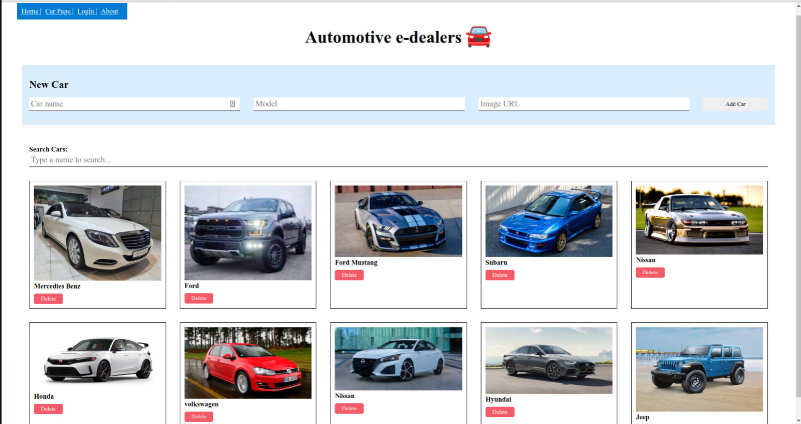

# Automobile-Dealers
Our app is designed to provide a seamless user experience with advanced features. We aim to revolutionize the industry by offering innovative solutions to our users.

### Contributors of this Project
* Tyler Kirumba 
* Rolex Omondi
* Mutindi Hope
* Erick Mwangi

# Description
This is a simple automobile dealing web app that allows users to experience advanced features for their preferred car:
* Type
* Model
* features
* Transmission

# Setup/Installation Requirements
## Git
* Install Git on your local directory
# Github
* Create a Github account: https://github.com
* Create a Github repository
* Copy the link of this repository
* Clone it to your local machine
* Use a suitable code editor to view the live site: code.visualstudio.com
# Web Browser
* Chrome or Firefox
# Setup Installation
* Copy the link of this repository
```
https://github.com/ErickMwangi/Automobile-Dealers
```
* Clone it to your local machine
```
git clone https://github.com/ErickMwangi/Automobile-Dealers
```
* Open terminal and navigate to the directory of the project
```
cd Automobile-Dealers
```
* Run the following command to install the back-end dependencies
```
    pipenv install
    pipenv shell
    python seed.py
    export FLASK_APP=app.py
    export FLASK_RUN_PORT=5555
    python app.py

```
* Run the following command to install the front-end dependencies
```
    npm install
    npm start

```
## Some Screenshots
* Homepage


<br />

* Carpage

# Known Bugs
* There are no known bugs of this project at the moment
# Technologies Used
* HTML
* CSS
* React JS
* Python
## Support and contact details
For any contributions towards this project:
* Email: tylerkirumba@gmail.com
* Email: rolexomondi46@gmail.com
* Email: mutindihope14@gmail.com
* Email: rickthetri20@gmail.com
# License
MIT License

Copyright (c) 2021 Moringa school

Permission is hereby granted, free of charge, to any person obtaining a copy of this software and associated documentation files , to deal in the Software without restriction, including without limitation the rights to use, copy, modify, merge, publish, distribute, sublicense, and/or sell copies of the Software, and to permit persons to whom the Software is furnished to do so, subject to the following conditions:

The above copyright notice and this permission notice shall be included in all copies or substantial portions of the Software.

THE SOFTWARE IS PROVIDED "AS IS", WITHOUT WARRANTY OF ANY KIND, EXPRESS OR IMPLIED, INCLUDING BUT NOT LIMITED TO THE WARRANTIES OF MERCHANTABILITY, FITNESS FOR A PARTICULAR PURPOSE AND NONINFRINGEMENT. IN NO EVENT SHALL THE AUTHORS OR COPYRIGHT HOLDERS BE LIABLE FOR ANY CLAIM, DAMAGES OR OTHER LIABILITY, WHETHER IN AN ACTION OF CONTRACT, TORT OR OTHERWISE, ARISING FROM, OUT OF OR IN CONNECTION WITH THE SOFTWARE OR THE USE OR OTHER DEALINGS IN THE SOFTWARE.
